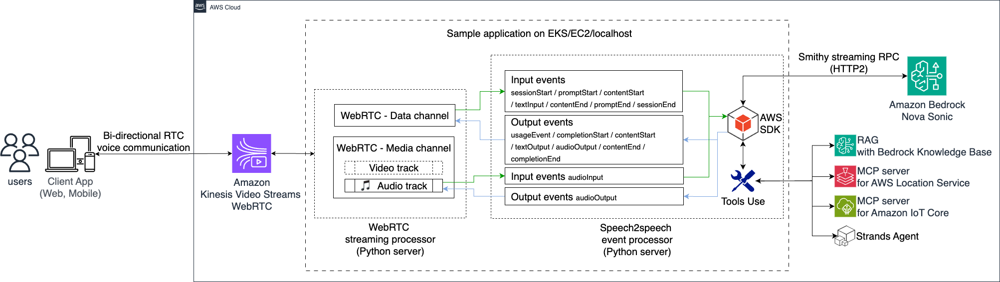

# Nova S2S WebRTC Workshop

A comprehensive Speech-to-Speech (S2S) WebRTC solution integrating AWS Bedrock Nova Sonic, Amazon Kinesis Video Streams with WebRTC, and real-time audio/video processing.

The sample solution architecture:


## 🚀 Features

### Capabilities
- **Real-time WebRTC Communication**: Low-latency audio streaming using Amazon KVS WebRTC
- **AI-Powered Speech Processing**: Integration with AWS Bedrock Nova Sonic for advanced speech-to-speech capabilities
- **Cross-Platform Support**: Works seamlessly on Windows, macOS, and Linux
- **Production Ready**: Optimized for both development and production environments
- **Modular Architecture**: Separate Python backend and React frontend for flexibility
- **Agent Integration**: Support for MCP (Model Context Protocol) and Strands agents

## 📋 System Requirements

### Tested Configuration

This solution has been tested and verified with the following exact versions:

**Core Dependencies:**
- **Python**: 3.12.x
- **numpy**: 1.26.4 (installed via conda as av dependency)
- **av (PyAV)**: 11.0.0 (installed via conda for FFmpeg linking)
- **aiortc**: 1.6.0 (installed via pip with dependency management)
- **ffmpeg**: 6.1.2+ (installed via conda)

**AWS SDK:**
- **boto3**: ≥1.34.0
- **aws-sdk-bedrock-runtime**: ≥0.0.1
- **smithy-aws-core**: ≥0.1.0

**Agent Integration:**
- **mcp**: ≥1.0.0
- **strands-agents**: ≥0.1.0

### Hardware Requirements
- **CPU**: Multi-core processor (Intel i5/AMD Ryzen 5 or better recommended)
- **RAM**: Minimum 4GB, 8GB recommended for optimal performance
- **Storage**: At least 2GB free space for dependencies and build files
- **Network**: Stable internet connection with low latency for real-time communication
- **Audio**: Microphone and speakers/headphones for testing

### Software Requirements

#### Cross-Platform Support
- **Windows**: Windows 10 or later
- **macOS**: macOS 10.15 (Catalina) or later (Intel and Apple Silicon)
- **Linux**: Ubuntu 18.04+, CentOS 7+, or equivalent distributions

#### Python Backend
- **Python**: 3.12 (required for AWS Bedrock runtime)
- **Conda**: Miniconda or Anaconda (required for proper FFmpeg/PyAV linking)
- **System Dependencies**: ffmpeg, pkg-config (automatically handled by conda)

#### React Frontend
- **Node.js**: 16.0 or higher (18.x LTS recommended)
- **npm**: 8.0 or higher (comes with Node.js)
- **Browser**: Modern browser with WebRTC support (Chrome 80+, Firefox 75+, Safari 14+, Edge 80+)

#### AWS Requirements
- **AWS Account**: Active AWS account with appropriate permissions
- **AWS Services Access**:
  - Amazon Kinesis Video Streams
  - AWS Bedrock (Nova Sonic model access)
  - IAM permissions for KVS and Bedrock

## 🏗️ Project Structure

```
sample-nova-sonic-speech2speech-webrtc/
├── README.md                    # This file
├── start-python-server.sh      # Python server launcher script (cross-platform)
├── start-react-client.sh       # React client launcher script
├── python-webrtc-server/        # Python WebRTC backend
│   ├── webrtc_server.py        # Main server application
│   ├── environment.yml         # Conda environment configuration
│   ├── requirements.txt        # Python pip dependencies
│   ├── .env.template          # Environment configuration template
│   ├── webrtc/                # WebRTC modules
│   ├── integration/           # AWS and agent integrations
│   └── server_test_audio/     # Test audio files
├── react-webrtc-client/        # React frontend application
│   ├── src/                   # React source code
│   ├── public/                # Static assets
│   ├── package.json           # Node.js dependencies
│   └── .env.template          # Frontend environment template
└── docs/                      # Additional documentation
    ├── troubleshooting.md     # Comprehensive troubleshooting guide
    ├── architecture.md        # System architecture
    ├── api-reference.md       # API documentation
    └── deployment.md          # Deployment guide
```

## ⚡ Quick Start

### 1. Prerequisites Installation

#### Install Conda (Recommended for Cross-Platform Compatibility)

**macOS:**
```bash
# Using Homebrew (easiest)
brew install miniconda

# Or download installer
curl -O https://repo.anaconda.com/miniconda/Miniconda3-latest-MacOSX-x86_64.sh  # Intel
curl -O https://repo.anaconda.com/miniconda/Miniconda3-latest-MacOSX-arm64.sh   # Apple Silicon
bash Miniconda3-latest-MacOSX-*.sh
```

**Linux:**
```bash
# Download and install
curl -O https://repo.anaconda.com/miniconda/Miniconda3-latest-Linux-x86_64.sh
bash Miniconda3-latest-Linux-x86_64.sh

# Or use package manager
sudo apt install miniconda3        # Ubuntu/Debian
sudo yum install miniconda3        # CentOS/RHEL
```

**Windows:**
```powershell
# Using Windows Package Manager
winget install Anaconda.Miniconda3

# Or using Chocolatey
choco install miniconda3

# Or download installer from: https://repo.anaconda.com/miniconda/
```

#### Install Node.js
- Download from [nodejs.org](https://nodejs.org/) (LTS version recommended)
- Or use version managers like nvm

### 2. Project Setup

```bash
# Navigate to the project directory
cd sample-nova-sonic-speech2speech-webrtc/

# Make scripts executable (Linux/macOS)
chmod +x *.sh

# Verify prerequisites
python3 --version  # Should be 3.8+
node --version     # Should be 16.0+
conda --version    # Should show conda version
```

### 3. AWS Configuration

#### Create AWS Credentials
1. **Create AWS Account** if you don't have one
2. **Create IAM User** with programmatic access
3. **Attach Required Policies**:
   - `AmazonKinesisVideoStreamsFullAccess`
   - `AmazonBedrockFullAccess`

#### Create KVS Signaling Channel (Required)

Before running the application, you must create the KVS WebRTC signaling channel:

**Option 1: Using AWS Console (Recommended)**
1. Open the [Amazon Kinesis Video Streams Console](https://console.aws.amazon.com/kinesisvideo/)
2. Navigate to **Signaling channels** in the left sidebar
3. Click **Create signaling channel**
4. Enter channel name: `nova-s2s-webrtc-test`
5. Leave other settings as default
6. Click **Create signaling channel**

**Option 2: Using AWS CLI**
```bash
# Create the signaling channel
aws kinesisvideo create-signaling-channel \
    --channel-name nova-s2s-webrtc-test \
    --region ap-northeast-1

# Verify the channel was created
aws kinesisvideo list-signaling-channels \
    --region ap-northeast-1 \
    --query 'ChannelInfoList[?ChannelName==`nova-s2s-webrtc-test`]'
```

**Important Notes:**
- The channel name must match the `KVS_CHANNEL_NAME` in your environment configuration
- The channel must be created in the same AWS region as specified in your configuration
- If using a different channel name, update the `KVS_CHANNEL_NAME` variable in your `.env` files

#### Configure Environment Files

**Python Backend (.env):**
```bash
# Copy and edit environment template
cp python-webrtc-server/.env.template python-webrtc-server/.env
nano python-webrtc-server/.env  # Edit with your values
```

Required variables:
```bash
# AWS Configuration
AWS_REGION=ap-northeast-1
AWS_ACCESS_KEY_ID=your_access_key_here
AWS_SECRET_ACCESS_KEY=your_secret_key_here

# KVS WebRTC Configuration
KVS_CHANNEL_NAME=nova-s2s-webrtc-test

# Bedrock Configuration
BEDROCK_MODEL_ID=amazon.nova-sonic-v1:0

# Logging Configuration
LOGLEVEL=INFO
```

**React Frontend (.env):**
```bash
# Copy and edit environment template
cp react-webrtc-client/.env.template react-webrtc-client/.env
nano react-webrtc-client/.env  # Edit with your values
```

Required variables:
```bash
# AWS Configuration (embedded in client-side code)
REACT_APP_AWS_REGION=ap-northeast-1
REACT_APP_AWS_ACCESS_KEY_ID=your_access_key_here
REACT_APP_AWS_SECRET_ACCESS_KEY=your_secret_key_here

# KVS WebRTC Configuration
REACT_APP_KVS_CHANNEL_NAME=nova-s2s-webrtc-test

```

### 4. Start the Services

#### Automated Setup (Recommended)

**Terminal 1 - Python Backend:**
```bash
# This script handles conda environment creation, dependency installation, and server startup
./start-python-server.sh

# The script automatically:
# 1. Creates conda environment with Python 3.12, ffmpeg, pkg-config
# 2. Installs av=11.0.0 via conda for proper FFmpeg linking
# 3. Installs all Python packages via pip with conflict resolution
# 4. Starts the WebRTC server
```

**Terminal 2 - React Frontend:**
```bash
# This script handles npm installation and client startup
./start-react-client.sh

# Available options:
# ./start-react-client.sh --port 3001
# ./start-react-client.sh --build  # Production build
# ./start-react-client.sh --serve  # Serve production build
```

#### Manual Setup (Alternative)

**Python Backend:**
```bash
cd python-webrtc-server

# Method 1: Create conda environment manually
conda env create -f environment.yml
conda activate nova-s2s-webrtc
pip install -r requirements.txt

# Method 2: If you've successfully run start-python-server.sh
conda activate nova-s2s-webrtc

# Configure environment variables
export AWS_ACCESS_KEY_ID=your_access_key_here
export AWS_SECRET_ACCESS_KEY=your_secret_key_here
export AWS_REGION=ap-northeast-1
export KVS_CHANNEL_NAME=nova-s2s-webrtc-test

# Start server
python webrtc_server.py

# Available options:
python webrtc_server.py --agent mcp
```

**Important Notes:**
- **Conda is required** (not optional) for proper av/FFmpeg linking
- **Python 3.12** is required for AWS Bedrock runtime compatibility
- **av=11.0.0** must be installed via conda to avoid compilation issues

**React Frontend:**
```bash
cd react-webrtc-client

# Install dependencies
npm install

# Start development server
npm start
```

### 5. Access and Test

1. **Frontend**: Open `http://localhost:3000` in your browser
2. **Grant Permissions**: Allow microphone access when prompted
4. **Test Connection**: Click "Start Session" and speak into your microphone

### 6. Verification (Optional)

#### Test WebRTC Configuration

The React app includes a built-in WebRTC testing feature that verifies your complete setup:

```bash
# 1. Start the Python server
./start-python-server.sh

# 2. Start the React client  
./start-react-client.sh

# 3. In browser (http://localhost:3000):
#    - Click the Settings icon (⚙️) in the top-right corner
#    - Scroll down and click "Test WebRTC Configuration"
#    - Grant microphone and camera permissions when prompted
#    - You should see your video feed and hear test scale audio tones
#    - The Python server will save the captured audio/video files in the logs folder
```

**What this test does:**
- ✅ Establishes WebRTC peer connection with Python server
- ✅ Captures audio from microphone and video from camera
- ✅ Transmits real-time audio/video data to Python server
- ✅ **Server saves captured media files** in `logs/media_test/` folder for verification
- ✅ **Plays back test scale audio tones** to verify audio pipeline
- ✅ Confirms end-to-end WebRTC functionality

**Files created during test:**
- `logs/media_test/webrtc_test_*.mp4` - Captured video from your camera and microphone
- Check these files to verify audio/video quality and synchronization

**Note:** This test requires the Python server to be running and uses the full WebRTC pipeline including server-side processing.

## 🔧 Advanced Configuration

### Run Python Server in Viewer Mode of KVS WebRTC

The Python server supports both Master and Viewer modes for KVS WebRTC signaling channels. Viewer mode allows the server to join an existing WebRTC session as a participant rather than initiating it.

#### Environment Setup
```bash
# Navigate to server directory and activate conda environment
cd sample-nova-sonic-speech2speech-webrtc/python-webrtc-server
conda activate nova-s2s-webrtc

# Configure AWS credentials and region
export AWS_ACCESS_KEY_ID=your_access_key_here
export AWS_SECRET_ACCESS_KEY=your_secret_access_key_here
export AWS_REGION=ap-northeast-1
export KVS_CHANNEL_NAME=nova-s2s-webrtc-test

# Optional: Knowledge Base integration
export KB_ID="your_knowledge_base_id"
export KB_REGION="ap-northeast-1"

# Configure server logging level
export LOGLEVEL="DEBUG"  # or "INFO" for production
```

#### Server Execution Modes

**Master Mode (Default):**
```bash
# Basic master mode - initiates WebRTC signaling
python webrtc_server.py
python webrtc_server.py --webrtc-role Master

# Master mode with MCP agent integration
python webrtc_server.py --webrtc-role Master --agent mcp
```

**Viewer Mode:**
```bash
# Basic viewer mode - joins existing WebRTC session
python webrtc_server.py --webrtc-role Viewer

# Viewer mode with MCP agent integration
python webrtc_server.py --webrtc-role Viewer --agent mcp
```

**Mode Differences:**
- **Master Mode**: Initiates and manages the signaling channel, designed for integration with the React frontend application (as the Viewer)
- **Viewer Mode**: Joins existing signaling channels as a participant, operates independently and supports integration with [KVS WebRTC test page](https://awslabs.github.io/amazon-kinesis-video-streams-webrtc-sdk-js/examples/index.html) and [KVS WebRTC SDK applications](https://docs.aws.amazon.com/kinesisvideostreams-webrtc-dg/latest/devguide/webrtc-sdks.html) as the Master.

### Cross-Platform Considerations

#### Platform-Specific Execution
```bash
# macOS/Linux Terminal
./start-python-server.sh

# Windows Git Bash (Recommended)
./start-python-server.sh

# Windows PowerShell
bash ./start-python-server.sh

# Windows Command Prompt
bash start-python-server.sh
```

#### Dependency Management Strategy

**Our Proven Approach:**
- **Conda**: System dependencies (Python 3.12, ffmpeg, pkg-config, av=11.0.0)
- **Pip**: Python packages (aiortc, AWS SDK, MCP, Strands agents)

| Component | Installation Method | Reason |
|-----------|-------------------|---------|
| Python 3.12 | Conda | Required for AWS Bedrock runtime |
| ffmpeg | Conda | System dependency for media processing |
| pkg-config | Conda | Build tool for native extensions |
| av=11.0.0 | Conda | Requires proper FFmpeg linking |
| aiortc | Pip (with --no-deps) | Avoids conda dependency conflicts |
| AWS SDK | Pip | Latest versions and compatibility |
| All other packages | Pip | Maximum compatibility and flexibility |

**Why This Approach:**
- ✅ **Cross-platform compatibility** (macOS, Ubuntu, Windows)
- ✅ **Avoids compilation errors** (no gcc required)
- ✅ **Proper FFmpeg linking** for media processing
- ✅ **Latest package versions** via pip
- ✅ **Conflict resolution** between conda and pip packages

### Python Server Options

```bash
# Basic usage
./start-python-server.sh

# Custom AWS region and signaling channel configuration
./start-python-server.sh \
  --region us-west-2 \
  --channel my-test-channel

# Testing and development
./start-python-server.sh --skip-deps  # Skip dependency installation
./start-python-server.sh --test-only  # Test environment setup only
```

### React Client Options

```bash
# Development server
./start-react-client.sh

# Production build and deployment
./start-react-client.sh --build       # Build for production
./start-react-client.sh --serve       # Serve production build
./start-react-client.sh --port 3001   # Custom port
```

### Environment Management

#### Conda Environment Commands
```bash
# List environments
conda env list

# Activate/deactivate
conda activate nova-s2s-webrtc
conda deactivate

# Update environment
conda env update -n nova-s2s-webrtc -f environment.yml

# Remove environment
conda env remove -n nova-s2s-webrtc
```

#### Automated Setup Process

The `start-python-server.sh` script handles all dependency management automatically:

**What the script does:**
1. **Detects your platform** (macOS, Linux, Windows)
2. **Checks system dependencies** (provides installation guidance if missing)
3. **Creates conda environment** with Python 3.12, ffmpeg, pkg-config
4. **Installs av=11.0.0** via conda for proper FFmpeg linking
5. **Installs Python packages** via pip with conflict resolution
6. **Verifies all imports** work correctly
7. **Starts the WebRTC server**

**Platform-specific handling:**
- **Linux**: Tries av=11.0.0, falls back to compatible versions if needed
- **macOS**: Installs av=11.0.0 with proper Apple Silicon support
- **Windows**: Handles Git Bash, PowerShell, and WSL environments

**Error prevention:**
- **No compilation required** - uses pre-built conda packages
- **Prevents pip conflicts** - uses constraints and staged installation
- **Proper shell escaping** - avoids creating unwanted files
- **Comprehensive verification** - tests all critical imports


## WebRTCVAD Configuration
### Enable/Disable WebRTCVAD

Control whether VAD filtering is used:

```bash
# Enable WebRTCVAD filtering (default)
export WEBRTCVAD_ENABLED=true

# Disable VAD - send all audio to Nova Sonic
export WEBRTCVAD_ENABLED=false
```

### VAD Aggressiveness Levels

When VAD is enabled, set the `VAD_AGGRESSIVENESS` environment variable to control sensitivity:

```bash
# Most permissive (detects more audio as speech)
export VAD_AGGRESSIVENESS=0

# Low aggressiveness
export VAD_AGGRESSIVENESS=1

# Moderate (default, recommended)
export VAD_AGGRESSIVENESS=2

# Most aggressive (strictest speech detection)
export VAD_AGGRESSIVENESS=3
```

### Aggressiveness Level Guide

| Level | Description | Use Case |
|-------|-------------|----------|
| **0** | Least aggressive | Noisy environments, capture more speech |
| **1** | Low | Slightly noisy environments |
| **2** | Moderate | **Default** - balanced for most use cases |
| **3** | Most aggressive | Quiet environments, strict speech filtering |

### Frame Processing
- **Frame Duration**: 30ms (configurable)
- **Sample Rate**: 16kHz (Nova Sonic compatible)
- **Frame Size**: 480 samples per frame
- **Processing**: Each audio chunk is split into frames and analyzed

### VAD Enabled (Default)
```
✅ WebRTCVAD enabled - Aggressiveness level: 2
🎤 [VAD] Speech detected (3/10 frames, 30.0%) - sending audio chunk to Nova Sonic
🔇 [VAD] No speech detected (0/10 frames, 0.0%) - skipping transmission to Nova Sonic
```

### VAD Disabled
```
🔇 WebRTCVAD disabled via WEBRTCVAD_ENABLED=false - sending all audio to Nova Sonic
🎵 [NO-FILTER] Sending all audio to Nova Sonic (VAD disabled)
```

## WebRTC Audio Data Format Adaption
WebRTC protocol has defined specific audio and video format standards. When transceiving audio data through WebRTC connection, we need some adaption work. Please refer to the [documentation](./docs/AudioDataAdaption.md).


## 🏠 Use Case Examples

### Smart Home Example

The Nova S2S WebRTC solution can be used with smart home demo for voice-controlled automation:

**Example Commands:**
- "Turn on the living room lights and set them to 50% brightness"
- "What's the temperature in the bedroom?"
- "Create a bedtime routine that turns off all lights and locks the doors"

**Configuration:**
```bash
# Smart home settings
export KB_ID="xxxxxx"
export KB_REGION="ap-northeast-1"
# Start server with MCP integration
python webrtc_server.py --agent mcp
```

### Connected Vehicle Example

The example shows in-vehicle voice assistance with real-time vision AI processing:

**Important Configuration for Vehicle Testing:**
- **Enable VP8 codec** on KVS WebRTC Test Page Master
- Use the test page at: https://awslabs.github.io/amazon-kinesis-video-streams-webrtc-sdk-js/examples/index.html
- Configure the Python server in Viewer mode to connect to the test page

**Vehicle Setup Steps:**
```bash
# Start server in Viewer mode for vehicle testing
cd python-webrtc-server
conda activate nova-s2s-webrtc
export ENABLE_PHONE_DETECTION=true
python webrtc_server.py --webrtc-role Viewer
```

**KVS Test Page Configuration:**
1. Open [KVS WebRTC Test Page](https://awslabs.github.io/amazon-kinesis-video-streams-webrtc-sdk-js/examples/index.html)
2. **Enable VP8 codec** in the video configuration (required for vehicle compatibility)
3. Set channel name to match your server configuration
4. Start as Master, then start your Python server in Viewer mode
5. Hold mobile phone, then you'll see the detection video clips in logs/

## 🧪 Testing and Verification

### Audio Testing

#### Full S2S Testing
1. **Start Normal Mode**: `./scripts/start-python-server.sh`
2. **Open Browser**: Navigate to `http://localhost:3000`
3. **Grant Permissions**: Allow microphone access
4. **Test Speech**: Click "Start Session" and speak
5. **Verify AI Response**: Wait for Nova Sonic AI response

#### Audio Quality Checks
- **Microphone Test**: Use built-in browser microphone test
- **Test Audio Files**: Use provided files in `server_test_audio/`
- **Latency Monitoring**: Check browser console for timing metrics
- **Audio Levels**: Verify input/output audio levels in interface

### Performance Testing
```bash
# Monitor system resources during testing
top -p $(pgrep -f "python.*webrtc")  # Linux/macOS
# Task Manager on Windows

# Check memory usage
ps aux | grep -E "(python|node)" | grep -v grep

# Network connectivity test
ping your-aws-region.amazonaws.com
```

## 🔍 Troubleshooting

### Quick Diagnostics
```bash
# System health check
ps aux | grep -E "(python|node)" | grep -v grep

# Check port availability
netstat -tulpn | grep -E "(3000|8765)"  # Linux
lsof -i :3000,8765                      # macOS
netstat -an | findstr "3000"           # Windows

# Check system resources
free -h    # Linux
vm_stat    # macOS
# Task Manager > Performance tab (Windows)
```

### Common Issues and Solutions

#### Python Dependencies
```bash
# If start-python-server.sh fails, try manual environment recreation:
conda env remove -n nova-s2s-webrtc -y
conda env create -f python-webrtc-server/environment.yml
conda activate nova-s2s-webrtc
pip install -r python-webrtc-server/requirements.txt

# Common dependency issues:
# - "av compilation failed" → Use conda for av installation
# - "FFmpeg not found" → Ensure conda ffmpeg is installed
# - "numpy version conflict" → Let conda handle numpy via av dependency
```

#### AWS Configuration
```bash
# Check AWS credentials
aws configure list
echo $AWS_ACCESS_KEY_ID

# Test AWS connectivity
aws sts get-caller-identity

# Verify KVS signaling channel exists
aws kinesisvideo list-signaling-channels --region ap-northeast-1
aws kinesisvideo describe-signaling-channel --channel-name nova-s2s-webrtc-test --region ap-northeast-1

# Common KVS channel issues:
# Error: "Signaling channel not found" - Create the channel first (see AWS Configuration section)
# Error: "Access denied" - Check IAM permissions for KinesisVideoStreams
# Error: "Invalid region" - Ensure channel exists in the correct region
```

#### WebRTC Connection Issues
```bash
# Use the built-in Test WebRTC Configuration first (see Testing section above)
# Check logs/media_test/ folder for saved test files to verify data transmission

# Check browser console for errors:
# - "getUserMedia failed" - Check microphone permissions
# - "ICE connection failed" - Check network/firewall
# - "WebSocket connection failed" - Check server status
```

#### Port Conflicts
```bash
# Find and kill processes using ports
# Linux/macOS:
lsof -ti:3000 | xargs kill -9

# Windows:
netstat -ano | findstr :3000
taskkill /PID <PID> /F

# Or use different port for React client:
./scripts/start-react-client.sh --port 3001
```

#### Cross-Platform Issues

**macOS:**
```bash
# Update Xcode Command Line Tools
xcode-select --install

# Apple Silicon specific
conda config --add channels conda-forge
conda config --set channel_priority strict
```

**Linux:**
```bash
# Permission issues (never use sudo with conda)
conda config --set auto_activate_base false

# Update system packages
sudo apt update && sudo apt upgrade  # Ubuntu/Debian
```

**Windows:**
```bash
# Initialize conda for different shells
conda init bash       # Git Bash
conda init powershell  # PowerShell

# Enable long paths (Windows 10+)
# Windows Settings > Update & Security > For developers > Developer Mode
```

### Performance Issues
```bash
# High CPU usage - check processing load
top -p $(pgrep -f "python.*webrtc")

# Memory leaks - monitor over time
watch -n 1 'ps aux | grep python | grep webrtc'

# Audio quality issues - check sample rates and buffer sizes
# See docs/troubleshooting.md for detailed audio optimization
```

### Getting Help
1. **Check Logs**: 
   - Python: `logs/webrtc_server.log`
   - Browser: Developer Tools Console
2. **Test WebRTC**: Use "Test WebRTC Configuration" in React app Settings
   - Verify test files are created in `logs/media_test/` folder
   - Listen to captured audio and check video quality
3. **Detailed Troubleshooting**: See [docs/troubleshooting.md](docs/troubleshooting.md)

## 📚 Documentation

- **[docs/troubleshooting.md](docs/troubleshooting.md)**: Comprehensive troubleshooting guide
- **[docs/architecture.md](docs/architecture.md)**: System architecture and design
- **[docs/api-reference.md](docs/api-reference.md)**: API endpoints and WebSocket events
- **[docs/deployment.md](docs/deployment.md)**: Production deployment guide


## 🏭 Production Deployment

For production deployment:

1. **Security**: Use IAM roles instead of access keys where possible
2. **Scaling**: Consider load balancing for multiple server instances
3. **Monitoring**: Implement comprehensive logging and monitoring
4. **SSL/TLS**: Use HTTPS for production deployments

See [docs/deployment.md](docs/deployment.md) for detailed production setup instructions.

## Security

See [CONTRIBUTING](CONTRIBUTING.md#security-issue-notifications) for more information.

## License

This library is licensed under the MIT-0 License. See the LICENSE file.

