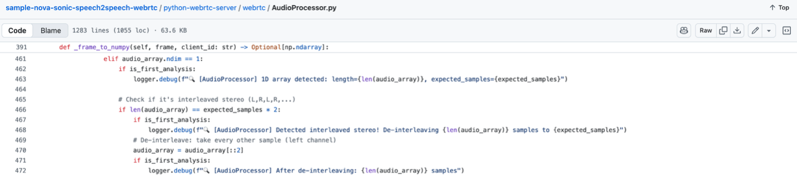
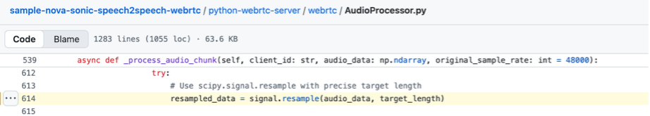
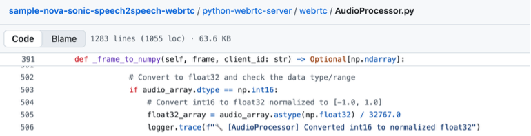

# Audio data format adaption
WebRTC library has defined standards for audio and video frames. When obtaining media data through WebRTC connection, we need some adaption work. The related details are given below.

## Interleaved layout unpacking
WebRTC potocol support both mono and stereo audio. The audio frames are obtained by calling function AudioFrame.to_ndarray() of PyAV library. If the audio is mono (single channel), an audio frame will be simply a vector of int16 sample values: [L1, L2, L3, L4, ...]. But if the audio is stereo (left channel + right channel), the frame will be a vector of interleaved int16 sample values: [L1, R2, L2, R2, L3, R3, L4, R4, ...]. As shown below, the function _frame_to_numpy() identify the interleaved layout, and take the left channel for further processing.

 
## Sampling rate 48kHz to 16kHz
In modern audio application, 48kHz is default sampling rate for devices and browsers for optimal performance. Considering cross-platform compatibility, optimal audio quality and hardware limit, the WebRTC library may automatically converts audio to hardware's native sampling rate 48kHz or others, disregarding your custom AudioContext sampleRate configuration. Therefore, a resampling function based on scipy.signal.resample has been added to detect the actual sampling rate, and convert it to 16kHz, as required by Nova Sonic API.
 

## Type conversion from int16 to float32
According to DSP best practice, the resampling process, it’s necessary to convert int16 audio data (16-bit signed PCM) to float32, so as to increase calculation precision, data range and CPU hardware efficiency of the cloud server.

