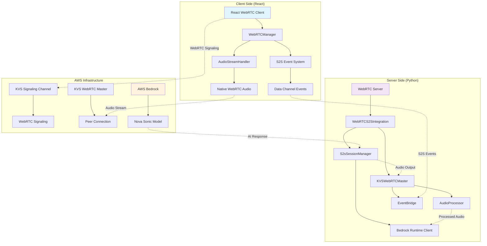
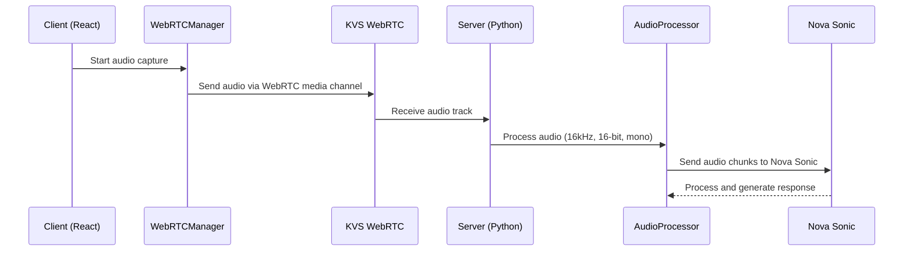
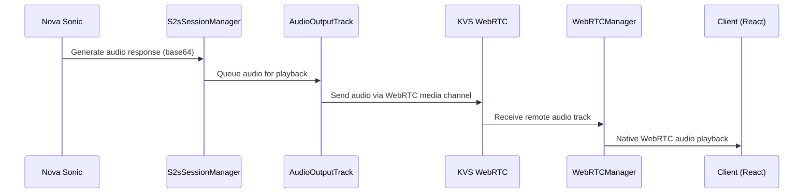
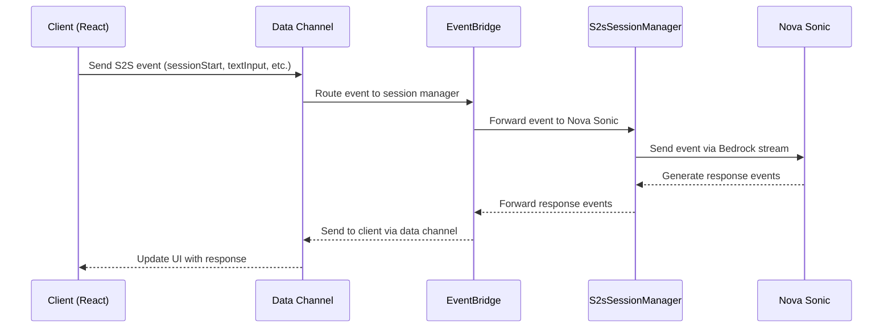

# Nova Sonic WebRTC Architecture Documentation

## Overview

The Nova Sonic WebRTC system is a real-time speech-to-speech (S2S) communication platform that integrates Amazon Kinesis Video Streams (KVS) WebRTC with AWS Bedrock's Nova Sonic model. The system enables bidirectional audio streaming with AI-powered conversational capabilities.

## System Architecture



## Component Architecture

### 1. Client-Side Components (React)

#### WebRTCManager
- **Purpose**: Core WebRTC client implementation following AWS KVS SDK patterns
- **Key Features**:
  - Native WebRTC audio handling (no custom processing)
  - KVS signaling channel management
  - Peer connection lifecycle management
  - Data channel for S2S events
- **Audio Configuration**:
  ```javascript
  audioConstraints: {
    echoCancellation: false,
    noiseSuppression: false,
    autoGainControl: false,
    sampleRate: 16000,        // Nova Sonic: 16kHz
    sampleSize: 16,           // Nova Sonic: 16-bit
    channelCount: 1           // Nova Sonic: mono
  }
  ```

#### AudioStreamHandler
- **Purpose**: Audio level monitoring and stream management
- **Responsibilities**:
  - Real-time audio level detection
  - Stream capture and monitoring
  - Audio quality metrics

#### S2S Event System
- **Purpose**: Manages communication with Nova Sonic model
- **Event Types**:
  - `sessionStart`: Initialize conversation session
  - `promptStart`: Begin new prompt context
  - `contentStart`: Start content block (text/audio)
  - `textInput`/`audioInput`: Send user input
  - `contentEnd`: End content block
  - `sessionEnd`: Terminate session

### 2. Server-Side Components (Python)

#### WebRTCS2SIntegration
- **Purpose**: Main integration layer between WebRTC and S2S systems
- **Key Responsibilities**:
  - Client session lifecycle management
  - Audio routing between WebRTC and Nova Sonic
  - Event handling and forwarding
  - Loopback mode for testing

#### KVSWebRTCMaster
- **Purpose**: WebRTC master server implementation
- **Components**:
  - **AudioProcessor**: Real-time audio processing and buffering
  - **EventBridge**: S2S event routing and management
  - **AudioOutputTrack**: Audio playback to WebRTC clients
  - **MediaRecorder**: Audio recording for testing/debugging
  - **PerformanceMonitor**: System performance tracking

#### S2sSessionManager
- **Purpose**: Manages bidirectional streaming with AWS Bedrock
- **Key Features**:
  - Bedrock Runtime Client integration
  - Audio input/output queue management
  - Session state tracking
  - Tool integration (MCP, Strands Agent)

## Data Flow Architecture

### 1. Audio Input Flow



### 2. Audio Output Flow



### 3. Event Flow



## Integration Points

### 1. AWS Services Integration

#### Kinesis Video Streams (KVS)
- **Signaling Channel**: WebRTC signaling and ICE negotiation
- **Media Streaming**: Real-time audio transmission
- **Authentication**: AWS credentials and SigV4 signing

#### AWS Bedrock
- **Nova Sonic Model**: Speech-to-speech AI processing
- **Bidirectional Streaming**: Real-time audio input/output
- **Event-Driven Communication**: Structured S2S events

### 2. External Tool Integration

#### MCP (Model Context Protocol) Client
- **Purpose**: External tool and API integration
- **Usage**: Extend Nova Sonic capabilities with external data sources

#### Strands Agent
- **Purpose**: Advanced query processing and external integrations
- **Usage**: Handle complex queries requiring external knowledge

## API Specifications

### 1. WebRTC Data Channel Events

#### Client to Server Events

```json
{
  "event": {
    "sessionStart": {
      "timestamp": "2024-01-01T00:00:00Z"
    }
  }
}
```

```json
{
  "event": {
    "textInput": {
      "promptName": "webrtc_prompt",
      "contentName": "user_input",
      "content": "Hello, how are you?"
    }
  }
}
```

#### Server to Client Events

```json
{
  "event": {
    "textOutput": {
      "role": "ASSISTANT",
      "contentId": "response_1",
      "content": "Hello! I'm doing well, thank you for asking."
    }
  }
}
```

```json
{
  "event": {
    "audioOutput": {
      "contentId": "audio_response_1",
      "content": "base64_encoded_audio_data"
    }
  }
}
```

### 2. Audio Processing Specifications

#### Input Audio Format
- **Sample Rate**: 16,000 Hz
- **Bit Depth**: 16-bit
- **Channels**: 1 (mono)
- **Format**: Linear PCM (LPCM)
- **Encoding**: Raw audio samples

#### Output Audio Format
- **Sample Rate**: 24,000 Hz (Nova Sonic output)
- **Bit Depth**: 16-bit
- **Channels**: 1 (mono)
- **Format**: Linear PCM (LPCM)
- **Encoding**: Base64-encoded audio chunks

### 3. Session Management API

#### Session States
- `INITIALIZING`: Setting up Bedrock connection
- `READY`: Ready to process audio/events
- `PROCESSING`: Actively processing user input
- `RESPONDING`: Generating AI response
- `ERROR`: Error state requiring restart

#### Session Control Commands
```json
{
  "type": "SESSION_CONTROL",
  "command": "restart|pause|resume",
  "timestamp": 1640995200000
}
```

## Performance Characteristics

### 1. Latency Metrics
- **WebRTC Signaling**: < 100ms
- **Audio Transmission**: < 50ms (one-way)
- **Nova Sonic Processing**: 200-500ms (depending on input length)
- **End-to-End Latency**: 300-700ms

### 2. Audio Quality
- **Input Processing**: Real-time with 20ms chunks
- **Output Quality**: High-fidelity speech synthesis
- **Noise Handling**: Configurable noise suppression
- **Echo Cancellation**: Optional (disabled for Nova Sonic compatibility)

### 3. Scalability
- **Concurrent Sessions**: Limited by server resources
- **Audio Buffer Management**: Adaptive buffering based on network conditions
- **Memory Usage**: Optimized for real-time processing

## Security Considerations

### 1. Authentication
- **AWS Credentials**: Access Key ID, Secret Access Key, Session Token
- **KVS Channel Access**: IAM-based permissions
- **Bedrock Access**: Model-specific permissions

### 2. Data Protection
- **Audio Encryption**: WebRTC DTLS/SRTP encryption
- **Data Channel Security**: WebRTC DTLS encryption
- **AWS Transit**: TLS 1.2+ for all AWS API calls

### 3. Privacy
- **Audio Storage**: Optional debug recording (disabled by default)
- **Session Isolation**: Per-client session management
- **Data Retention**: Configurable retention policies

## Deployment Architecture

### 1. Development Environment
```
Client (localhost:3000) ←→ WebRTC Server ←→ AWS Services
```

### 2. Production Environment
```
Client (HTTPS) ←→ Load Balancer ←→ WebRTC Servers ←→ AWS Services
                                      ↓
                              Auto Scaling Group
```

### 3. High Availability
- **Multi-AZ Deployment**: WebRTC servers across availability zones
- **Load Balancing**: Session-aware load balancing
- **Failover**: Automatic failover for WebRTC sessions
- **Monitoring**: CloudWatch metrics and alarms

## Troubleshooting Architecture

### 1. Logging Strategy
- **Client Logs**: Browser console and exported logs
- **Server Logs**: Structured logging with correlation IDs
- **AWS Logs**: CloudWatch integration for AWS services

### 2. Monitoring Points
- **WebRTC Connection Health**: ICE connection state monitoring
- **Audio Quality Metrics**: Real-time audio level monitoring
- **Session State Tracking**: S2S session lifecycle monitoring
- **Performance Metrics**: Latency and throughput monitoring

### 3. Debug Modes
- **Loopback Mode**: Audio echo testing without Nova Sonic
- **Audio Recording**: Optional audio capture for debugging
- **Verbose Logging**: Detailed event and audio processing logs

## Future Architecture Considerations

### 1. Scalability Enhancements
- **WebRTC Clustering**: Multi-server WebRTC deployment
- **Session Persistence**: Redis-based session storage
- **Audio Processing Optimization**: GPU-accelerated audio processing

### 2. Feature Extensions
- **Video Support**: WebRTC video streaming integration
- **Multi-Language Support**: Language detection and switching
- **Advanced AI Features**: Integration with additional Bedrock models

### 3. Performance Optimizations
- **Edge Deployment**: CloudFront edge locations for WebRTC
- **Adaptive Bitrate**: Dynamic audio quality adjustment
- **Predictive Buffering**: AI-driven buffer management