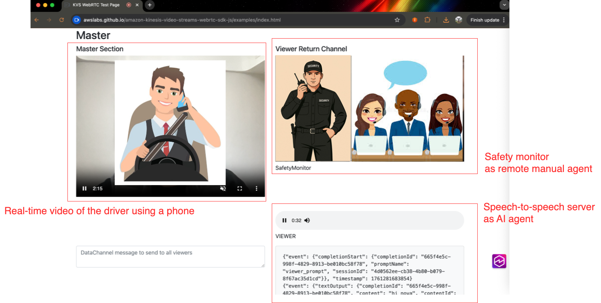

# Configure connected-vehicle demo

**Overall steps to run the demo:**

1. Open [KVS WebRTC Test Page](https://awslabs.github.io/amazon-kinesis-video-streams-webrtc-sdk-js/examples/index.html)
2. **Enable VP8 codec** in the video configuration
3. Set channel name to match your server configuration, e.g. `nova-s2s-webrtc-test`
4. Start as Master in test page 
5. Start your Python server in Viewer mode (see section "Run Python server as Viewer")
6. Hold mobile phone on your hand, then you'll see the detection video clips in directory `logs/`
7. Open the test page in a new browser tab, start as Viewer.

**Environment setup:**

```bash
# activate Conda env
cd python-webrtc-server
conda activate nova-s2s-webrtc
# AWS credential and parameters
export AWS_ACCESS_KEY_ID=your_AWS_Access_Key
export AWS_SECRET_ACCESS_KEY=your_AWS_Secret_Key
export AWS_REGION=ap-northeast-1
export KVS_CHANNEL_NAME=nova-s2s-webrtc-test
```

**Run Python server as Viewer:**

```bash
# Enable phone-use detection
export ENABLE_PHONE_DETECTION=true
# Start server in Viewer mode for vehicle
python webrtc_server.py --webrtc-role Viewer
```

**Demo:**

