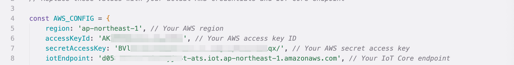
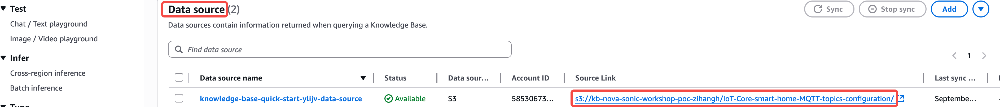
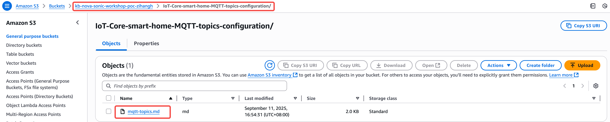
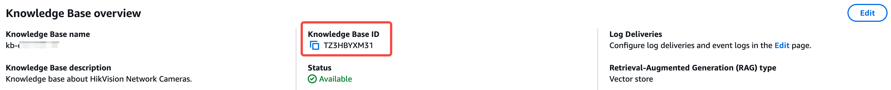
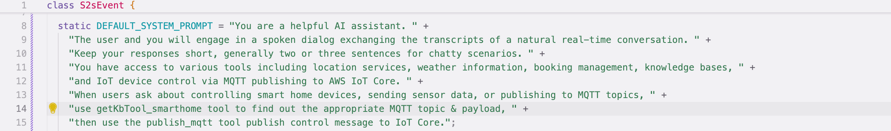
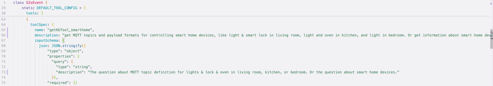
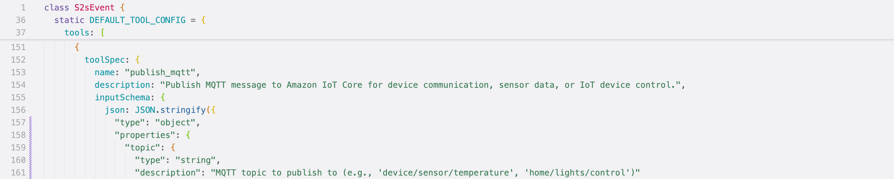
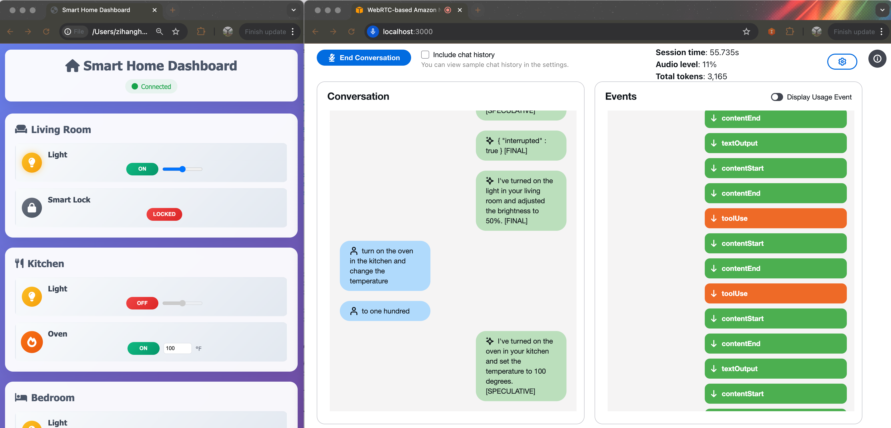

# Configure simulation demo

Navigate to the Web demo which simulates connected devices at home. Modify the file config.js.
```bash
cd sample-nova-sonic-speech2speech-webrtc/examples/smart-home
nano web-demo/config.js 
```
Obtain your AWS credentials, AWS region, [IoT Core data endpoint](https://docs.aws.amazon.com/cli/latest/reference/iot/describe-endpoint.html), then fill the configuration:



Open `index.html` in your browser. The app will automatically connect virtual devices to Amazon IoT Core, and subscribe to corresponding MQTT topics for control commands.

# Setup Knowledge-Base in Amazon Bedrock.

Follow the [workshop guidance](https://catalog.us-east-1.prod.workshops.aws/workshops/5238419f-1337-4e0f-8cd7-02239486c40d/en-US/02-repeatable-pattern/01-kb-lab) to create your knowledge base in Amazon Bedrock. Upload the file mqtt-topics.md to your S3 bucket of Knowledge Base source link.




Copy the Knowledge Base ID and export :



```bash
export KB_ID="your_Knowledge_Base_ID"
export KB_REGION="ap-northeast-1"
```

Download IoT Core MCP server, download it as follows:
```bash
git clone https://github.com/aws-samples/sample-MCP_server-for-Amazon_IoT_Core.git
```

Follow [Quick Start](https://github.com/aws-samples/sample-MCP_server-for-Amazon_IoT_Core) to create Python virtual environment and install dependencies. Export the configuration to environment variables:
```bash
export IOT_ENDPOINT=axxxxxxx-ats.iot.ap-northeast-1.amazonaws.com
export IOT_MCP_SERVER_PATH=/absolute_path_to/sample-MCP_server-for-Amazon_IoT_Core
export IOT_MCP_PYTHON_PATH=/absolute_path_to_your_Python_venv/bin/python
export IOT_MCP_SERVER_SCRIPT=/absolute_path_to/sample-MCP_server-for-Amazon_IoT_Core/server.py
```

# Review the prompt and tool definition.

The system prompt and tool use configuration are defined in the React setting.
The system prompt has explicitly told AI which tools (`getKbTool_smarthome`, `publish_mqtt`) are available and their responsibilities. You can modify and optimize according to your actual business scenarios.



The tool specification are defined as follows:




The knowledge base data retrieving is processed in retrieve_kb() function in bedrock_knowledge_bases.py
The MCP client for IoT Core access is defined in mcp_iot_client.py to invoke the MCP server and publish commands.

# Run the application.

* In terminal 1, run the Python server:

```bash
cd sample-nova-sonic-speech2speech-webrtc/python-webrtc-server
python webrtc_server.py --agent mcp
```

* In terminal 2, run React app with following commands, and click “Start Conversation”

```bash
cd sample-nova-sonic-speech2speech-webrtc/react-webrtc-client
npm start
```

* Speak to Nova Sonic: “Please turn on the light in my living room and adjust the brightness”; “Can you turn on the oven in the kitchen and change the temperature to 100?”.

* You can see the status change of simulated devices on the dashboard:


